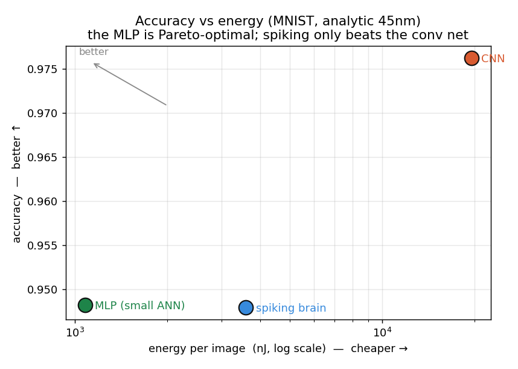

# Teaching a Spiking "Brain" to Imagine

*The full story of a solo AI project — the idea, the build, what it can do, and what it honestly
taught me when I tested it hard.*

---

## 1. The idea I couldn't let go of

We usually build image classifiers as one-way machines: pixels go in, a label comes out. But that's
not really how a brain seems to work. Brains *predict*. They fill in the blind spot, hallucinate the
rest of a half-hidden face, "see" the word even when half the letters are smudged. Perception looks
less like a lookup and more like a **loop** — a guess about the world, refined against what the eyes
actually report. Philosophers and neuroscientists call it *analysis by synthesis*: to recognize
something, imagine the thing that would have produced what you're seeing.

I wanted to build that. A network that, shown a corrupted image, doesn't just guess — it
**reconstructs what it expects to see, looks again, and decides.** Perception as imagination.

And I wanted to build it the brain's way: with **spiking neurons** — units that fire discrete pulses
over time instead of emitting smooth numbers — arranged in a 2D sheet with *zones*, the way cortex
has sensory areas, association areas, and motor areas. The dream was a single system that could
recognize, imagine, and maybe even organize itself into brain-like structure.

That's the idea. The rest of this post is what happened when I actually built it — and then tested
it more honestly than I wanted to.

## 2. Building the brain

The core is a **spiking recurrent sheet**. Each neuron integrates incoming current into a membrane
voltage and fires a spike when it crosses a threshold. The catch: a spike is a step function, and
step functions have no useful gradient, so you can't train them with ordinary backprop. The trick
(a *surrogate gradient*) is to fire the hard spike on the forward pass but pretend it was a smooth
curve on the backward pass. With that, the whole spiking sheet becomes trainable end to end.

On top of that sheet I built two models:

- **RecallBrain** — a network that does *both* jobs at once. It reads a class from a "motor" zone
  (recognition) *and* reconstructs the image from a decoder (imagination). Recognize + imagine, one
  network. Trained on clean digits, it reaches around **93%** accuracy — and, crucially, it can
  regenerate what it sees.
- **BiBrain** — the ambitious version: a **bidirectional, shared-weight** network. The *same* weight
  matrix runs one way to perceive (image → concept) and the other way to imagine (concept → image).
  One brain, run forwards and backwards.

Getting a spiking network to *generate* was the hardest part, and it taught me something. My first
version produced high-confidence garbage: it would respond to a "draw an oriented line" command with
the right *magnitude* but a random *sign* every run — it had learned a convention and then flipped a
coin on it. The fix was to let the encoder see the concept and to halve the feedback gain on the
down-pass, so ordinary reconstruction pinned the convention. Suddenly it drew clean, correctly-formed
images. Small bug, real lesson: when a generative model looks broken, check whether it's confidently
doing the wrong thing, not failing to do anything.

By the end, the system worked: it recognized, it imagined, and — as you'll see — it did some
genuinely striking things.

## 3. What it can do

This is the fun part, and it's all **real model output**, not mock-ups.

**It repairs its own perception.** Delete a third of an image — a dead-sensor simulation — and the
spiking sheet fires, imagines the missing strip from context, and re-recognizes the object:

**It dreams.** With *no input at all*, clamp a concept at the "motor" end and let activity flow down
through the shared weights to the "eyes" — and a digit forms out of the spikes:

**It separates *what* from *how*.** Fix the class and sweep the latent "style," and it imagines the
same digit in many handwritings — it has disentangled identity from style:

**And its neurons self-organize.** Give neurons movable positions and a simple "fire together, move
together" rule, and a random cloud sorts itself into smooth orientation domains — a little
cortex-like map:

Beyond the demos, I ran a careful characterization of *when* the imagination actually helps
perception, and it produced clean, reproducible findings:

- **It fixes gaps, not grime.** Top-down completion self-repairs *structured missing data* —
  occlusion, dropout, dead pixels — but it does **not** denoise. Under Gaussian noise it actually
  hurts, because the feedforward path already learned to see through noise. "Gaps, not grime" became
  a real, bounded claim.
- **It scales with redundancy.** The help is larger on Fashion-MNIST than on sparse digits, and the
  effect generalizes to natural CIFAR-10 images. There's even a beautiful reversal — scattered
  pixel-dropout is a *loss* on sparse digits but the *biggest* win on rich images, because
  redundancy makes scattered gaps reconstructable. It unifies into a tidy rule:
  **reconstructability = structure × redundancy.**

At this point I had a working brain-inspired model, four striking demos, and a characterized
finding. It genuinely felt like something.

## 4. The harder question: is it actually *better*?

Here's where I made the decision that shaped everything: before writing any of this up as a win, I'd
run the experiment most likely to prove me wrong. **Run the killer baseline first.**

The skeptic's question was obvious: *why imagine the missing pixels — why not just train on corrupted
images?* So I did. Plain occlusion augmentation improved accuracy by +0.23; my imagination loop, by
+0.07 — and adding imagination on top of augmentation did nothing. Augmentation won, three to one. It
stung.

But there was a real idea in the wreckage: augmentation only prepares you for corruptions you
*anticipated*. So I built the fair test — **leave-one-corruption-out**, at *equal test-time compute*,
against strong baselines (shift-augmentation and a test-time-adaptation method called MEMO). Train on
every corruption except a held-out one; win on the held-out one. And it **survived** — across MNIST,
Fashion-MNIST, *and* CIFAR-10, imagination beat all three baselines on unforeseen missing-data. The
scattered-dropout reversal showed up right on cue. For a couple of days, I thought I had a paper.

Then I noticed the confound, and this is the part I'm proudest of, even though it hurt. My method
quietly had an advantage the baselines didn't: it knew *which* pixels were missing — the mask. So I
gave a plain model the mask too. And a **zero-parameter trick — just filling the hole with the
average of the visible pixels — matched my generative model in seven of eight cases.** Most of the
"win" was mask access, not imagination.

I kept testing, because that's the job:

- A fancier "classify by imagining which class best explains the image" looked spectacular on MNIST
  (+0.41) and **didn't replicate** on Fashion-MNIST.
- "Generate to understand" is supposed to shine with few labels — but at 100 labels it *hurt*.
- A plain CNN beat the spiking net on accuracy by 18 points.
- And on *energy* — spiking's home turf — I measured it honestly (spikes → operations → joules) and a
  plain MLP **dominated** the spiking brain: same accuracy, a third of the energy. Spiking only beat
  the convolutional net, which is a low bar.

- And the original dream — that brain-like structure would *emerge* on its own? It doesn't. The
  topographic map only forms when you impose an explicit rule; I confirmed that three ways, including
  a control designed to falsify it.

Seven honest tests. Every time I gave the simple baseline a fair shot, it held its own or won.

## 5. What survived — and where this actually belongs

Stripped to what's true, the surviving finding is small but real:

> Test-time generative completion beats a trivial fill **only** when the missing region has texture
> that averaging can't reproduce — and the advantage *shrinks* as the classifier gets stronger.

That's honest, reproducible, and — checked against a 2025 literature review — a slice characterized
this precisely nowhere else.

And I learned the most useful thing of all: *I'd been keeping score on the wrong board.* I kept
grading a brain-inspired model on a CNN's metric — raw accuracy. But that's not where these ideas
live. Reading the current work — topographic networks (TDANN, TopoLM), spiking transformers
(Spikformer), the 2025 predictive-coding surveys, the Sensorium neural-prediction benchmarks — the
pattern is consistent: **brain-inspired methods compete on energy (neuromorphic hardware), on
explaining neural data, and on biological plausibility — almost never on raw accuracy.** My results
"losing" on accuracy is exactly what that literature predicts. Spiking pays off on spiking hardware.
That's not a defeat; it's a map of where to point the idea next.

## 6. What I actually built, and what I learned

Let me be fair to the project, because the honest accounting cuts both ways.

**What I built and stands up:** a spiking neural network that recognizes handwritten digits at ~93%,
generates legible digits top-down from a shared-weight generative model, self-repairs occluded input
by imagining the missing parts, and self-organizes into orientation domains — plus a careful,
reproducible characterization of exactly when top-down completion helps ("gaps, not grime;
reconstructability = structure × redundancy"). Every demo is real output; every claim has a figure.

**What I learned:**

- **Run the killer baseline first.** It's the line between research and marketing. It cost me a
  headline and saved me from publishing something wrong.
- **Negative results are results.** "Here's exactly what doesn't work, and why" saves the next person
  months.
- **You can be right about the idea and wrong about the battlefield.** Generative perception is real
  and powerful; I aimed it at problems a cheap discriminative model already solves. The right
  battlefield is unforeseen corruption — and neuromorphic hardware.
- **Watch your confounds.** My best result was quietly built on information the baselines didn't
  have. Always ask what your method knows that its opponent doesn't.
- **Know when *not* to refactor, or over-claim.** Sometimes the disciplined move is to leave a
  working thing alone and report it plainly.

## Was it worth it?

I didn't build a state-of-the-art anything, and I'm not going to pretend otherwise. But I built a
brain-inspired system that genuinely recognizes, dreams, and repairs its own perception; I
characterized where its one real advantage lives; and I tested the whole thing with the kind of
honesty most projects skip — then wrote down the losses as plainly as the wins.

The ideas were beautiful and the build was real. Testing them cleanly — and telling the truth about
what I found — was the point.

---

*Code, all thirty-odd experiments, and the demos above are on GitHub. Everything is real model
output; every claim has a figure; every negative result is reported as plainly as the positive
ones.* → **github.com/Ziadt160/BrainEmergence**
