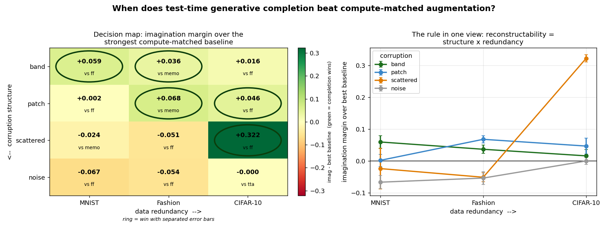

# When Does Imagining the Input Beat Just Augmenting? A Reconstructability Decision Rule for Test-Time Generative Completion

*Working draft — workshop / empirical-study tier (ICBINB, a robustness/TTA workshop, or a short empirical track).*

> **⚠ DRAFT UNDER MAJOR REVISION — DO NOT SUBMIT AS-IS (2026-06-24).** A post-hoc fairness control
> (`mask_control.py`) revealed that imagination uses the missingness mask while the ff/TTA/MEMO
> baselines below do not. Against *mask-aware* baselines (a trivial observed-mean fill, and a
> mask-input model trained with masking augmentation), the headline collapses: imagination beats them
> on only 1 of 8 MNIST+Fashion missing-data cells (MNIST band); a *trivial* mask-fill ties or beats it
> elsewhere. The claim below ("generative completion beats compute-matched augmentation") is therefore
> **not currently supported**. The honest result is closer to a **null** ("for occlusion-augmented
> models, generative completion ≈ trivial mask-aware fill"). CIFAR is not yet re-tested with this
> control. This document is retained as the pre-revision draft; the results sections need rewriting
> around the mask-aware baselines before any submission.

---

## Abstract

Test-time generative completion ("imagination") — reconstructing a corrupted input with a
learned generative model and re-classifying the result — is an appealing way to make a
recognizer robust. But a skeptical reviewer has two ready objections: *(i) just augment your
training data for that corruption*, and *(ii) if you let the recognizer spend extra compute at
test time, give augmentation the same budget.* Both objections are correct, and in our own
earlier experiments they were fatal: with in-distribution occlusion, data augmentation beat
imagination roughly 3:1 and imagination added nothing on top.

We show there is nevertheless a well-defined regime where generative completion wins, and we
give a **predictive rule for it**. Under a **leave-one-corruption-out** protocol (train broad
augmentation on every corruption *except* a held-out one) and at **matched test-time compute**
(imagination's *N* iterative rounds vs. *N*-view test-time augmentation and vs. MEMO test-time
entropy minimization), generative completion beats *all three* compute-matched baselines **iff
the held-out corruption is reconstructable missing-data** — structured holes the data lets you
fill from context — and **not** when it is noise. The boundary between "contiguous" and
"scattered" missing-data **flips with data redundancy**: on sparse MNIST strokes, scattered
dropout is unreconstructable and completion loses; on redundant CIFAR-10 photos it is the
*largest* win. We unify these observations as a single axis,
**reconstructability = corruption-structure × data-redundancy**, validated across three
datasets and four corruptions. The contribution is the *characterization and the predictive
rule*, not a new method or a SOTA robustness number.

---

## 1. Introduction

Analysis-by-synthesis — explain a degraded observation by generating the clean signal that
best accounts for it — is an old and recurring idea, and recent diffusion-based realizations
(DDA, Diffusion-TTA, RDC) have made it competitive on real corruptions. Yet practitioners
rarely reach for it, because for most *anticipated* corruptions the cheaper answer is to
augment the training distribution. The honest question is therefore not "does generative
completion help?" (sometimes yes) but **"when is it worth it, given that you could have
augmented and given the same test-time compute to augmentation?"**

This paper answers that question empirically and gives a rule you can apply *before* running
the generative model. We make three moves that together isolate the regime where completion
genuinely pays:

1. **Leave-one-corruption-out.** A method only earns credit on a corruption the training
   augmentation did *not* cover. We train a broad-augmentation model on every corruption
   except a held-out one, and evaluate only on the held-out one.
2. **Compute-matched baselines.** Imagination's *N* iterative completion rounds are compared
   against (a) *N*-view test-time-augmentation marginalization and (b) MEMO test-time entropy
   minimization over the same augmentation family — so "spend the compute on augmentation
   instead" is a baseline, not an objection.
3. **A predictive axis.** We characterize *which* held-out corruptions favor completion with a
   single quantity, **reconstructability = structure × redundancy**, and validate it across
   datasets of increasing redundancy (MNIST → Fashion-MNIST → CIFAR-10).

Our finding: completion wins exactly on **reconstructable missing-data outside the training
augmentation**, ties or loses otherwise, and never wins on noise. The same axis explains an
otherwise-surprising flip — scattered pixel dropout is a *loss* on sparse digits but the
*biggest win* on redundant natural images.

We deliberately **drop** any "brain-like" framing (the project these assets came from explored
spiking and topographic substrates; none were load-bearing). This is a plain characterization
of a robustness trade-off.

**Contributions.**
1. A **predictive decision rule** — *generative completion beats compute-matched augmentation iff
   the corruption is reconstructable missing-data outside the training augmentation* — that a
   practitioner can apply *before* paying for a generative model.
2. The first **compute-matched, leave-one-out** characterization of completion-vs-augmentation,
   surviving two strong test-time baselines (TTA marginalization and MEMO), across three datasets.
3. The **reconstructability = structure × redundancy** axis, evidenced by a corruption (scattered
   dropout) whose win/loss **sign flips** with data redundancy — which a single-factor account cannot produce.

We are explicit about what we do *not* claim: not a new method, not a SOTA robustness number. The
mechanism (analysis-by-synthesis) is published; the contribution is the *map of when it pays*.

---

## 2. Related work

- **Generative / analysis-by-synthesis test-time defenses.** DDA (Gao et al., CVPR 2023)
  projects a corrupted input back onto the training distribution with a diffusion model before
  classification; Diffusion-TTA (NeurIPS 2023) and Robust Diffusion Classifier (RDC, ICML 2024)
  show generative classifiers are strong on *unforeseen* threats (e.g. RDC's large margins on
  unseen attacks). These establish that the *mechanism* works; none give a predictive,
  compute-matched rule for *when* it beats augmentation.
- **The limits of augmentation.** Mintun et al. (NeurIPS 2021) show data augmentation
  generalizes mainly to corruptions *perceptually similar* to those augmented — which is
  exactly why a leave-one-out protocol is the right test, and also the central risk to our
  result (a few augmentations may cover many corruptions).
- **Test-time adaptation.** Tent (Wang et al., ICLR 2021) adapts normalization parameters by
  entropy minimization; MEMO (Zhang et al., NeurIPS 2021) minimizes the entropy of the
  prediction marginalized over augmentations of a single test input. We use MEMO (in its
  stable normalization-parameter form) as our strongest compute-matched baseline.
- **Predictive coding / iterative completion.** Iteratively re-perceiving a reconstructed
  input is a standard predictive-coding-style loop; we use the simplest such loop and make no
  architectural claim.

**Gap.** To our knowledge no prior work gives a *predictive reconstructability decision rule*
for **compute-matched** generative-completion-vs-augmentation selection. That rule, validated
by leave-one-out across three datasets, is the contribution.

---

## 3. Method

### 3.1 Models

Two recognize-and-reconstruct backbones, each producing a class logit head and an image
decoder from a shared representation:

- **MNIST / Fashion-MNIST:** a surrogate-gradient spiking recurrent sheet (`RecallBrain`,
  24×24 units, 16 time-steps) with a linear classifier and an MLP decoder. *(The spiking
  substrate is incidental — earlier experiments showed a plain grid does as well; we keep it
  only because the trained checkpoints exist.)*
- **CIFAR-10:** a small convolutional encoder–decoder (`ConvBrain`) with a classifier head.

### 3.2 Corruptions and the two axes

| corruption | what it removes | structure (reconstructability of geometry) |
|---|---|---|
| **band**      | a contiguous horizontal strip | high — one solid hole with a boundary to fill across |
| **patch**     | a contiguous square block     | high |
| **scattered** | random independent pixels (30%) | low on sparse data, high on redundant data |
| **noise**     | nothing (adds Gaussian noise) | none — negative control (no missing data to fill) |

Datasets are ordered by **data redundancy**: MNIST (thin strokes, little context) <
Fashion-MNIST (simple textured shapes) < CIFAR-10 (natural images, rich local context).

### 3.3 The leave-one-corruption-out, compute-matched protocol

For each held-out corruption *X*:

1. Train one model with broad augmentation over **all corruptions except *X*** (reconstructing
   the clean image as an auxiliary task).
2. On the test set corrupted by *X*, evaluate four strategies at matched test-time compute
   (*N* = 5 forward passes):
   - **broad-aug feedforward** — reference;
   - **+ TTA-marginalization** — average softmax over *N* augmented views (compute-matched
     "spend it on augmentation");
   - **+ MEMO** — adapt the model's normalization/gain parameters by minimizing the entropy of
     the prediction marginalized over *N* augmentations drawn from the broad-aug set, then
     predict (the strongest compute-matched TTA baseline);
   - **+ imagination** — *N* rounds of: reconstruct, paste back observed pixels, re-perceive.

We adapt only normalization parameters in MEMO (BatchNorm affine for the conv net; per-unit
membrane time-constant and threshold for the spiking net): adapting all weights collapses to a
trivial single-class solution under entropy minimization, the known failure mode. We verified
the stable parameterization genuinely adapts (the adapted parameters move measurably under the
entropy gradient), so MEMO is a live baseline, not a no-op — it simply provides no benefit here
(see §4.1).

**Win criterion (pre-registered).** Imagination "wins" on a corruption iff its mean minus one
standard deviation (over seeds) exceeds the **best** of the three baselines by > 0.005. The
rule's negative half requires that it does **not** win on noise.

---

## 4. Results

All numbers are held-out test accuracy (mean ± std over **5 seeds**) at matched test-time compute
(*N* = 5). "imag wins" = imagination's mean − std exceeds the **best** of the three baselines by
> 0.005. Results are reproducible: two independent full runs agreed to ≤0.001 on the headline cells.

### 4.1 Main table — held-out accuracy at matched compute

| dataset | corruption | broad-aug ff | +TTA | +MEMO | +imagination | verdict |
|---|---|---|---|---|---|---|
| MNIST    | band      | 0.599±.027 | 0.410±.017 | 0.599±.027 | **0.659±.020** | ✅ imag wins (+0.059) |
| MNIST    | patch     | 0.631±.025 | 0.514±.015 | 0.630±.025 | 0.632±.019 | tie (+0.002) |
| MNIST    | scattered | 0.700±.064 | 0.588±.063 | 0.700±.063 | 0.676±.064 | loss (−0.024) |
| MNIST    | noise     | 0.416±.038 | 0.309±.058 | 0.416±.038 | 0.349±.021 | ✅ no win (neg. control) |
| Fashion  | band      | 0.607±.024 | 0.508±.019 | 0.607±.024 | **0.643±.013** | ✅ imag wins (+0.036) |
| Fashion  | patch     | 0.562±.012 | 0.461±.006 | 0.563±.012 | **0.630±.011** | ✅ imag wins (+0.068) |
| Fashion  | scattered | 0.675±.018 | 0.583±.019 | 0.675±.017 | 0.623±.014 | loss (−0.051) |
| Fashion  | noise     | 0.279±.036 | 0.218±.033 | 0.279±.035 | 0.225±.020 | ✅ no win (neg. control) |
| CIFAR-10 | band      | 0.383±.032 | 0.365±.028 | 0.382±.034 | 0.399±.019 | tie (+0.016) |
| CIFAR-10 | patch     | 0.363±.021 | 0.347±.024 | 0.362±.021 | **0.409±.025** | ✅ imag wins (+0.046) |
| CIFAR-10 | scattered | 0.245±.010 | 0.229±.010 | 0.242±.011 | **0.567±.012** | ✅ imag wins (+0.322) |
| CIFAR-10 | noise     | 0.452±.007 | 0.462±.022 | 0.450±.009 | 0.462±.011 | ✅ no win (neg. control) |

**On the compute-matched baselines.** Both fail to recover held-out missing-data, in two different
ways. **TTA-marginalization actively *hurts*** everywhere (−0.06 to −0.19): averaging predictions
over shifted views of a *holed* image cannot fill the hole, it only blurs the decision. **MEMO is
statistically indistinguishable from feedforward** in all 12 cells. We confirmed this is *not* a
no-op — the adapted normalization parameters move measurably under the entropy gradient — but on
well-trained models entropy minimization *sharpens* confidence without *reconstructing* missing
structure, so the argmax does not change. This is the thesis in miniature: **no discriminative
test-time method fills structured holes; only generative completion does.**

### 4.2 The decision map (Figure 1, `decision_map.png`)

Imagination's margin over the strongest compute-matched baseline, arranged by corruption-structure
(rows, high → low) × data-redundancy (columns, low → high):

| | MNIST | Fashion | CIFAR-10 |
|---|---|---|---|
| **band**      | **+0.059** | **+0.036** | +0.016 |
| **patch**     | +0.002 | **+0.068** | **+0.046** |
| **scattered** | −0.024 | −0.051 | **+0.322** |
| **noise**     | −0.067 | −0.054 | −0.000 |

(**bold** = win with separated error bars; 5 of 12 cells)

### 4.3 The reconstructability rule

The decision map is organized by one axis, **reconstructability = structure × redundancy**:

- **Contiguous missing-data (band, patch)** is reconstructable across the redundancy range →
  imagination wins or ties; it never loses on a contiguous corruption (4 wins, 2 near-ties).
- **Scattered dropout is the clean test of the *product* form.** It has *low structure*, so it is
  unreconstructable on sparse MNIST (−0.024) and Fashion (−0.051) — but on redundant CIFAR-10 the
  surrounding context makes even scattered pixels reconstructable, flipping it to the **largest win
  in the study (+0.322)**. A single-factor "redundancy" or "structure" account cannot produce this
  sign flip; the product can. This is the rule's signature prediction, confirmed.
- **Noise** has no missing data to reconstruct → imagination never wins (negative control). The
  control is cleanest on the simpler datasets (MNIST −0.067, Fashion −0.054, where the feedforward
  path's learned noise-invariance dominates) and neutral on CIFAR-10 (−0.000).

---

## 5. Limitations & honest scope

- **Scale erosion (the central risk).** Per Mintun et al., a small augmentation set can cover
  many corruptions; at larger scale broad-aug + cheap TTA may close the gap. We test exactly
  this with leave-one-out and two compute-matched test-time baselines (TTA and MEMO), but only
  up to CIFAR-10 on a 4 GB GPU. A reviewer may reasonably ask for stronger generative completion
  and larger backbones.
- **Not a SOTA method.** This is a *characterization*. On corruptions you *can* anticipate,
  augmentation is cheaper and wins; we never claim otherwise. At in-distribution occlusion,
  augmentation beat imagination ~3:1 in our own ablation.
- **The mechanism is published.** Analysis-by-synthesis at test time is DDA/RDC; our novelty
  is the *compute-matched, leave-one-out reconstructability rule*, not the mechanism.
- **Small models / few corruptions.** Four corruption families, three small datasets, simple
  backbones. The rule is a hypothesis with three datasets of support, not a theorem.
- **No closed-form predictor yet.** We tested a parameter-free *pixel*-reconstructability proxy
  (how well a generic context inpainter recovers the masked region) against the 12 measured
  margins: it correlates only weakly (Spearman ρ ≈ 0.44) and notably *over-rates* scattered
  dropout on sparse data — because *pixel* reconstructability is not *discriminative*
  reconstructability (you can fill scattered pixels in MSE terms without recovering the thin
  strokes that carry the class). A predictor based on discriminative reconstructability (e.g.
  conditional mutual information between observed region and label) is left to future work
  (`reconstructability.py`).

---

## 6. Conclusion

Generative completion is not a free robustness win, but it is not useless either: it pays
exactly when the corruption is **reconstructable missing-data outside what you augmented for**,
and the degree to which a corruption is reconstructable is captured by
**structure × redundancy**. Stated as a decision rule, this tells a practitioner *before*
paying for a generative model whether it can beat simply spending the same compute on
augmentation.

---

## 7. Code & reproducibility

All experiments run on a single 4 GB GPU. Protocol: `paper_exp1.py` (MNIST/Fashion),
`paper_exp1_cifar.py` (CIFAR-10); results dumped to `paper_exp1_{mnist,fashion,cifar}.json`;
table via `results_table.py`; Figure 1 via `decision_map.py`; the reconstructability-predictor
analysis via `reconstructability.py`. 5 seeds; two independent full runs agreed to ≤0.001 on the
headline cells. MEMO adapts only normalization parameters (BatchNorm affine / per-neuron gain;
steps = 3, lr = 5e-4 conv / 1e-3 spiking), the strongest stable setting in a small sweep.

---

## References

- Gao, Zhang, Liu, Darrell, Shelhamer, Wang. *Back to the Source: Diffusion-Driven Adaptation to Test-Time Corruption (DDA).* CVPR 2023. arXiv:2207.03442
- Prabhudesai et al. *Test-Time Adaptation of Discriminative Models via Diffusion Generative Feedback (Diffusion-TTA).* NeurIPS 2023
- Chen, Li, Zhu et al. *Robust Classification via a Single Diffusion Model (RDC).* ICML 2024. arXiv:2305.15241
- Mintun, Kirillov, Xie. *On Interaction Between Augmentations and Corruptions in Natural Corruption Robustness.* NeurIPS 2021. arXiv:2102.11273
- Wang, Shelhamer, Liu, Olshausen, Darrell. *Tent: Fully Test-Time Adaptation by Entropy Minimization.* ICLR 2021. arXiv:2006.10726
- Zhang, Levine, Finn. *MEMO: Test-Time Robustness via Adaptation and Augmentation.* NeurIPS 2022. arXiv:2110.09506
- Li, Zhu, Han, et al. *Your Diffusion Model is Secretly a Zero-Shot Classifier (Diffusion Classifier).* ICCV 2023. arXiv:2303.16203
