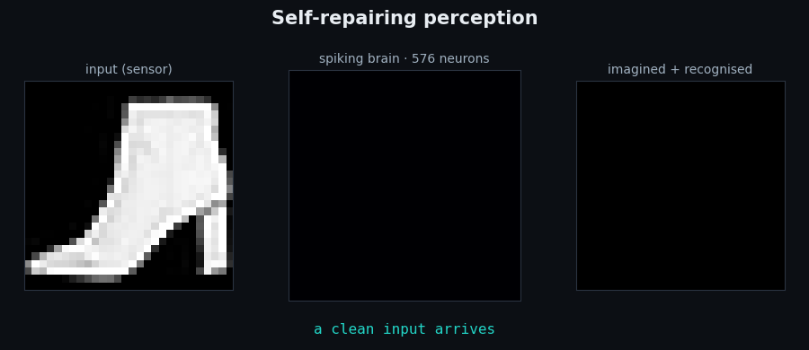
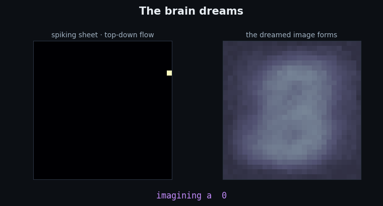
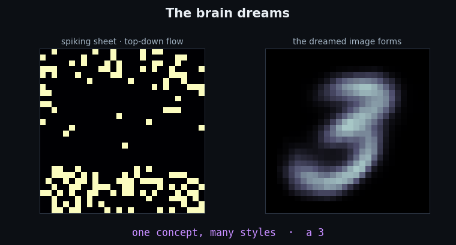
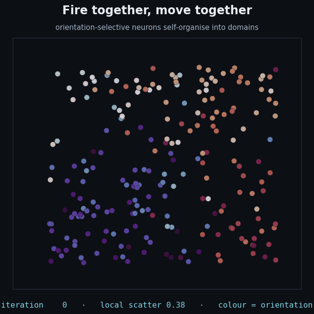

# BrainEmergence

**A brain-inspired, spiking neural network that recognizes images by *imagining* them — and a rigorous, honest study of when that actually beats simpler methods (mostly: it doesn't, and knowing exactly why is the result).**



*Above — all generated from the real trained model: a "sensor" loses 30% of the image, the spiking
"brain" fires, imagines the missing strip, and re-recognizes it. No stored copy; it reconstructs
from what it can still see.*

---

## The one-line story

This started as a vague *"let a brain emerge"* idea and became two things: a set of **eye-catching,
honestly-built demos**, and a **disciplined negative-results study**. Across ~30 controlled
experiments I kept asking the same question — *does the brain-inspired, generative approach beat a
plain, simpler baseline?* — and ran the exact baselines a reviewer would. The answer was almost
always **no**. This repo is the honest record of that, plus the demos that make the mechanism
visible.

> **Why show a project that "failed"?** Because it didn't fail — it *answered its question*. Running
> the baseline that could kill your idea, *before* you believe the idea, is the whole job. That
> discipline (and the clean negatives it produced) is the transferable result.

## Demos (all real model output)

**Dreaming** — no input at all: a concept is clamped at the "motor" zone, activity flows *down*
through the shared spiking sheet, and a digit forms out of the accumulating spikes.



**One concept, many styles** — fix the *class* and sweep the latent "style": the same digit is
imagined in many handwritings, showing the generative model has disentangled *what* from *how*.



**Self-organization** — movable neurons, starting at random positions, cluster into smooth
orientation domains under a *"fire together, move together"* rule.



<sup>Honest caveat: the map forms *only* with the explicit attraction rule — it does **not** emerge on
its own. That's one of the project's clean negative results, framed honestly, not a magic emergent map.</sup>

**Self-repair (digits)** — the simplest version of the top image: occlude a digit, imagine it back,
re-read it. `media/demo_brain_mnist.gif`

## The scoreboard — every claim, the fair baseline, the honest verdict

| Question | Fair baseline | Verdict |
|---|---|---|
| Does generative completion beat augmentation? | compute-matched TTA + MEMO + **mask-aware fill** | **No** — a 0-parameter average matched it (7/8 cells) |
| Is the spiking net more accurate? | a plain CNN | **No** — CNN +0.18 |
| Is a generative (Bayes) classifier more robust? | mask-aware, augmentation-trained discriminator | **No** — didn't replicate past MNIST |
| Does "generate to understand" help at few labels? | discriminative, same compute | **No** — it *hurt* at 100 labels |
| Is the spiking brain more energy-efficient? | a small MLP (analytic 45 nm model) | **No on a GPU** — the MLP dominates; the real win needs neuromorphic hardware |
| Do topographic "brain maps" emerge? | falsification controls | **No** — they must be imposed |
| Does completion *ever* beat a trivial fill? | observed-pixel mean-fill | **Only** on textured, contiguous gaps — and the edge shrinks as the classifier improves |

## What's genuinely real here

- **A ~93% spiking MNIST classifier** ([`brain_predict.py`](brain_predict.py)) reading a "motor" zone,
  and a **bidirectional spiking VAE** that recognizes *and* generates with shared weights
  ([`brain_generate.py`](brain_generate.py)) — the engines behind the demos.
- **A characterized robustness finding** (`imagine_robustness.py`, `imagine_noise.py`,
  `imagine_patterns.py`): top-down completion self-repairs *structured missing data* (occlusion,
  dropout) but **not noise** — "gaps, not grime" — and the benefit scales with data redundancy.
- **The one narrow positive that survives every control**: generative completion beats a *trivial*
  fill only when the missing region has texture that averaging can't reproduce.
- **A pile of clean negatives** (above) — genuinely useful "here's what doesn't work, and why."

## What did NOT work (these are findings too)

- Topographic maps don't *emerge* — shown three ways, including a falsification control.
- Brain-like structure (spiking, topography, movable neurons) never improved accuracy — decoration
  at best, a handicap at worst.
- Once a discriminative baseline is *fairly equipped* (given the mask, or augmentation, or just made
  a CNN/MLP), the generative/brain approach loses — on accuracy, robustness, few-label learning,
  and even analytic energy.

## More results & figures (in [`figures/`](figures/))

The receipts — every claim above has a figure. Highlights worth a look:

- [**generate_samples.png**](figures/generate_samples.png) — a spiking network *dreaming* legible
  per-class digits, top-down, from nothing (the still behind `demo_dream.gif`).
- [**energy_scoreboard.png**](figures/energy_scoreboard.png) — accuracy vs energy: the spiking brain
  beats the CNN but a plain MLP is Pareto-optimal — the honest "why spiking?" answer ([`energy.py`](energy.py)).
- [**ablation_mnist_band.png**](figures/ablation_mnist_band.png) — decomposes the pipeline: the spiking
  *classifier* is the weak link, not the generator ([`ablation.py`](ablation.py));
  [`cnn_pipeline_*`](figures/) shows a CNN base recovers it.
- [**mask_control_mnist.png**](figures/mask_control_mnist.png) — the killer baseline: a *trivial*
  mask-fill matches generative completion, deflating the headline ([`mask_control.py`](mask_control.py)).
- [**decision_map.png**](figures/decision_map.png) + [**reconstructability.png**](figures/reconstructability.png)
  — the reconstructability rule and its quantitative test (ρ ≈ 0.44 — honest about being only partial).
- [**semi_supervised_mnist.png**](figures/semi_supervised_mnist.png) — "generate-to-understand" *hurts*
  at 100 labels (a clean null).
- [**predict_accuracy.png**](figures/predict_accuracy.png), [**emergence_curve.png**](figures/emergence_curve.png)
  — the 93% spiking classifier and the original per-zone "emergence" measurement the project is named after.

## Repo map

**Importable core** — [`brainemergence/`](brainemergence/) re-exports the reusable models &
primitives behind a clean import surface: `from brainemergence import RecallBrain, BiBrain,
ConvBrain, spike_func`. *(A thin facade — definitions stay in their original modules, some of which
have intentionally diverged between experiments; consolidating live experiment code wasn't worth the
risk of silently changing published figures.)*

**Demos & visualization**
`demo.py` · `make_demo_video.py` (self-repair) · `make_dream_video.py` (generation) ·
`make_topo_video.py` (self-organization) → outputs in `media/`

**Core models**
`imagine_helps.py` (`RecallBrain`, the spiking recognize+imagine net) · `brain_generate.py`
(`BiBrain`, bidirectional VAE) · `brain_predict.py` (93% spiking classifier) · `cifar_imagine.py`
(`ConvBrain`) · `mnist_experiment.py` (surrogate-gradient primitives)

**The decision-rule study**
`paper_exp1.py` / `paper_exp1_cifar.py` (leave-one-out + compute-matched) · `decision_map.py`
(Figure 1) · `results_table.py` · `reconstructability.py` · `gating.py` · `paper_baseline.py`

**Rigor / killer-baseline controls** *(the heart of the project)*
`mask_control.py` (the mask-aware baseline that deflated the headline) · `gen_vs_disc_control.py`
(generative vs fair discriminative) · `ablation.py` (which component is the weak link) ·
`cnn_pipeline.py` (CNN vs spiking) · `energy.py` (accuracy-per-joule) · `semi_supervised.py`
(few-label) · `gen_classifier.py`

**Characterization sweeps**
`imagine_robustness.py` · `imagine_noise.py` · `imagine_patterns.py`

**Emergence / topography (historical, the negative-results arc)**
`snn_emergence.py` · `exp_alignment.py` · `movable_model.py` · `movable_test.py` ·
`brain_scan.py` (per-zone probes) · `fix_generation.py`

## Docs

- **[BLOG.md](BLOG.md)** — *"I taught a spiking brain to imagine — then spent months proving it
  wasn't good enough."* The full honest story, start to finish (a good place to begin).
- **[PAPER.md](PAPER.md)** — the write-up draft *(with an honest "do not submit as-is" banner: the
  mask-aware control deflated the headline).*
- **[HANDOFF.md](HANDOFF.md)** — the full internal state, results, and the critical updates.
- **[PROPOSAL.md](PROPOSAL.md)** / **[PAPER_PLAN.md](PAPER_PLAN.md)** — earlier plans, kept for the story.

## Run it

Python 3 + [`requirements.txt`](requirements.txt) (PyTorch, torchvision, numpy, matplotlib). Datasets
auto-download to `./data` on first run.

```bash
python demo.py                       # the classic visual demo (CPU is fine)
python make_demo_video.py --dataset fashion   # regenerate the self-repair animation
python make_dream_video.py           # the "dreaming" animation
python paper_exp1.py --dataset mnist --seeds 5   # the decision-rule experiment
```

## The honest takeaway

The value here isn't a new algorithm and it isn't a benchmark win — it's a **striking, honest body of
work**: demos that make a spiking generative network's behavior *visible*, and a rigorous map of
**where brain-inspired generation does and doesn't pay off**. Generating bold ideas *and* killing
them cleanly is the point.
